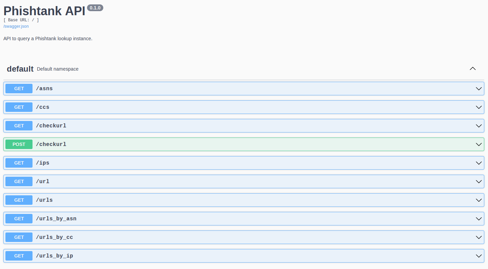

# phishtank-lookup
Simple web API using the hourly dump from Phishtank

This tool loads the [public dump](https://phishtank.org/developer_info.php) from [Phishtank](https://phishtank.org/),
loads it into Redis and allows to run queries against it. Note that it only contains the online and valid entries and is updated once per hour.

# Install guide

## System dependencies

You need poetry installed, see the [install guide](https://python-poetry.org/docs/).

## Prerequisites

You need to have redis cloned and installed in the same directory you clone `phishtank-lookup` in:
`phishtank-lookup` and and `redis` must be in the same directory, and **not** `redis` cloned in the
`phishtank-lookup` directory. See [this guide](https://www.lookyloo.eu/docs/main/install-lookyloo.html#_install_redis).

## Installation

From the `phishtank-lookup` directory you just cloned, run:

```bash
poetry install
echo PHISHTANK_HOME="`pwd`" >> .env
```

## Configuration

Copy the config file:

```bash
cp config/generic.json.sample config/generic.json
```

And configure it accordingly to your needs. You don't need an `phishtank_api_key`, but they might
block you if you fetch the dump too often (increase `dump_fetch_frequency` will probably do).

The `phishtank_useragent` should be [unique and descriptive](https://phishtank.org/developer_info.php).

`expire_urls` should not be too high if you're using the tool to check active phishs, but you do you.
For reference, the dump contains around 10.000 Unique URLs, so it's not too big (less than 1G in memory)

# Usage

Start the tool (as usual, from the `phishtank-lookup` directory):

```bash
poetry run start
```

You can stop it with

```bash
poetry run stop
```

With the default configuration, you can access the web interface on `http://0.0.0.0:5300`,
where you will find the API and can start playing with it.


